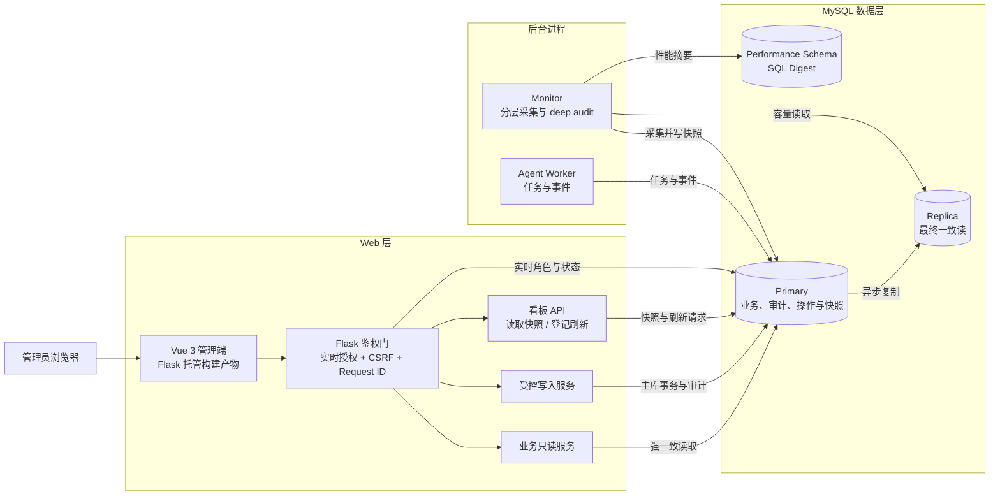

# 管理员系统结构说明

文档职责：以架构图和功能地图概览管理员系统当前组成、安全边界及运维交接要点；详细实现由管理员模块权威文档负责。

适用范围：面向管理员前后端、数据库治理和后台进程的整体理解；接口、部署和测试细节分别以 [API 契约](api.md)、[开发说明](development.md) 和 [测试说明](testing.md) 为准。

> 当前事实基线：阶段一管理员后台及截至 2026-08-24 的后续修复；历史来源包括 PR [#23](https://github.com/Heyflyingpig/CausalAgent/pull/23)、[#27](https://github.com/Heyflyingpig/CausalAgent/pull/27) 和 [#28](https://github.com/Heyflyingpig/CausalAgent/pull/28)。

## 一、定位与架构

管理员系统是独立于普通聊天页面的治理面：前端位于 `admin-frontend/`，采用 Vue 3、TypeScript、Vue Router、共享 `@causalagent/design-system`、Element Plus 和 Vite；共享包负责品牌基础、按钮、卡片、标记、标题、标签页及加载/空/错误状态，Element Plus 保留表格、抽屉、对话框、Descriptions、表单控件、选择器、Timeline、Tooltip、Collapse 和局部加载遮罩。Flask 负责页面鉴权、API 与生产静态资源托管。Node 只参与镜像构建，生产运行时不启动 Vite。

[可编辑 draw.io 架构图](admin-system-architecture.drawio)

## 二、功能地图

| 模块 | 主要能力 |
| --- | --- |
| 业务概览 | 汇总用户、会话、消息、任务和文件规模，并展示最近监控状态。 |
| 用户与权限 | 查询用户；受控启停、切换 `user/admin`、重设密码；预览并物理删除用户。 |
| 会话与任务 | 筛选会话、消息、附件、Job 和事件；正文仅在明确点击后分块读取。 |
| 文件资产 | 查询详情、安全预览 CSV、下载文件、查看删除影响并物理删除 BLOB。 |
| 数据库治理 | 查看主从、连接、容量、完整性、Worker/Job 和 SQL Digest；配置七项采集参数；执行 quick/deep 审计。PR #28 后 Digest 按平均耗时降序展示，同值再按累计耗时排序。 |

## 三、关键机制

每次管理请求都从主库重新确认账号是否启用、`auth_version`，以及由 `user_roles` 与 `role_permissions` 解析出的 `admin.access` 权限；未登录返回 `401`，缺少管理员权限返回 `403`（错误码 `admin_required`），页面未登录跳转 `/auth/sign-in?next=<管理页面>`。普通管理写请求要求 Session CSRF；用户和文件写入还必须经过主库影响预览、明确确认、当前管理员密码重认证和 `Idempotency-Key`。成功变更、`admin_operations`、逐目标 `admin_operation_items` 与审计事件在同一事务提交；系统禁止操作者禁用、降级或删除自己，并通过事务锁保护最后一个启用管理员。

敏感正文单次最多读取 64 KiB，成功读取要求审计可写，审计不保存正文。CSV 仅按文本预览，限制 256 KiB、100 行、50 列。文件与用户删除均为物理删除且没有回收站；存在活动任务或关联量超过阈值时会阻断。

看板 GET 不现场执行重采集，只读取 `database_monitor_snapshots`。手动刷新仅登记请求，独立 monitor 通过 MySQL 命名锁采集 `realtime`、`sql_performance`、`capacity`、`integrity` 和仅手动触发的 `deep_audit`，再写回主库共享快照。默认开发拓扑包含 Web、Job worker、monitor、agent-persistence-cleanup、统一 bootstrap、MySQL 主从、PostgreSQL checkpoint 及独立可观测组件；副本异常时读路径回退主库，不提供自动故障切换。

## 四、边界与维护

当前只初始化 `user` 与 `admin` 两个角色，授权判断统一读取 `user_roles` 与 `role_permissions` 权限表，`users.role` 只作为过渡兼容字段；后台不提供自定义角色与权限的管理界面，也不提供任意 SQL、迁移、自动修复、数据库授权、复制控制或任务控制。结构变更必须通过 Alembic，并同步检查 `app/db.py` 就绪检查。管理员前端设计系统统一的代码检查包括共享包 typecheck、unit/check，管理员端 typecheck、unit、build，以及管理员部署和四前端入口的 Python 静态契约测试；本轮不把浏览器、数据库或隔离环境验收混入页面样式交付。构建产物不进入版本库，未构建时 `/admin/` 返回带 request ID 的 `503`。
