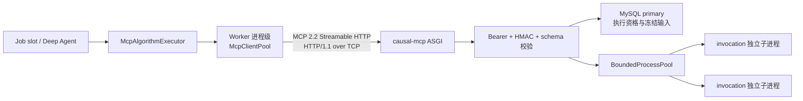
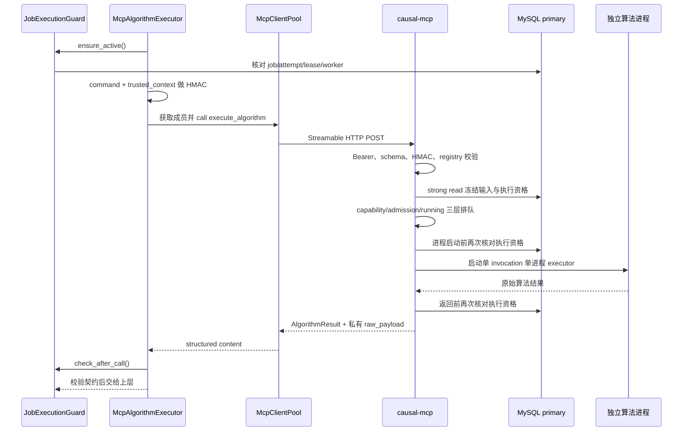
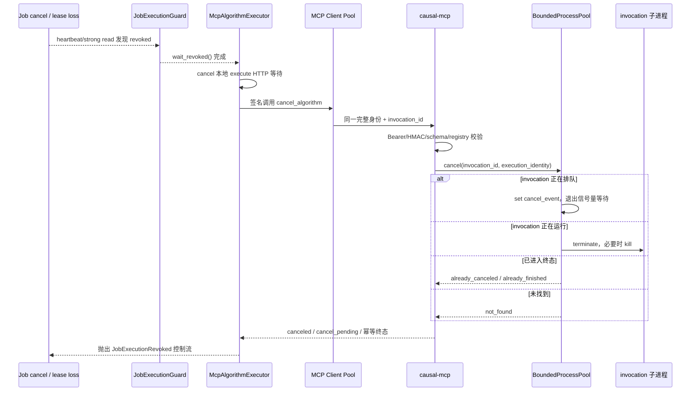

# MCP 池构造、通信与取消机制

文档职责：说明当前生产路径中 Worker 进程级 MCP 客户端池、`causal-mcp` 服务端算法执行池、两者之间的 Streamable HTTP 通信、精确取消与故障恢复机制。

适用范围：阅读或修改 `app/agent/worker/mcp_client_pool.py`、`Agent/deep_agent_tools/mcp_algorithm_executor.py`、`Agent/CausalAgentMCP/`、Worker 启动配置及 MCP 部署参数时使用；Job 的 API 状态机和持久化取消语义见 [`job-file-lifecycle.md`](job-file-lifecycle.md) 与 [`../api/agent-jobs.md`](../api/agent-jobs.md)。

## 先区分两个“池”

当前链路有两个职责不同的池。Worker 内的 `McpClientPool` 管理 MCP 连接、请求槽位和传输重连；`causal-mcp` 内的 `BoundedProcessPool` 管理算法排队、并发和可终止的 CPU 子进程。前者不执行算法，后者不管理 Worker 的 MCP 会话。



生产 Worker 的每个操作系统进程只有一个客户端池。所有 slot 和 Job 共享该池，但 Job 身份、checkpoint、Action Ledger 和执行资格不保存在池中；它们通过每次调用的可信上下文显式传递。服务端同样使用无状态 HTTP，MCP session 只承担协议传输。

## Worker 侧客户端池

### 组成与启动

`initialize_production_runtime()` 在 Worker ready 之前创建并启动客户端池。启动过程如下：

1. 创建一个共享 `httpx2.AsyncClient`，注入服务级 Bearer Token，固定使用 HTTP/1.1，并设置 TCP/HTTP 连接数、keep-alive、连接超时、池等待超时和读取超时。
2. 根据 execute/control 两组配置创建两类 `McpClientMember`。默认成员为 `mcp-execute-1`、`mcp-execute-2` 和 `mcp-control-1`；每个成员有稳定 `member_id`、递增 `generation`、lane、自身的 MCP Client、并发上限、健康状态和 drain 状态。
3. 每个成员由独立 `owner_task` 创建、持有并关闭 MCP SDK/AnyIO context。这保证建立和清理 cancel scope 的任务一致，避免跨任务退出上下文。
4. 成员完成 MCP 初始化后调用 `list_tools()` 做握手，必须同时发现 `execute_algorithm` 与 `cancel_algorithm`。这里的工具列表只用于能力检查，不用于动态生成模型可见工具。
5. 任一成员初始化失败都会使 Worker 在领取 Job 前启动失败。关闭 Worker 时先让成员停止并关闭 MCP context，最后关闭共享 HTTP Client。

默认客户端并发容量是：

```text
普通 lane：2 × 1 = 2
控制 lane：1 × 2 = 2
MCP 成员总请求槽：4
```

`max_connections` 和 `max_keepalive_connections` 都必须不小于两个 lane 容量之和；控制容量也必须不小于普通容量。这个公式只表示 Worker 侧最多同时占用多少 MCP 请求槽，不表示算法一定能同时运行。

### 获取成员与负载分配

`execute_algorithm` 固定取得 execute lane，`cancel_algorithm` 固定取得 control lane。两个 lane 互不借用槽位；池只在目标 lane 选择 `healthy=true`、`draining=false` 且尚有空闲 in-flight 槽的成员，先比较 `inflight / max_in_flight` 选择最低负载组，再在同负载成员间轮询。普通 lane 默认最多等待 5 秒，控制 lane 独立最多等待 1 秒。调用结束后 lease 在 `finally` 中释放并唤醒等待者。

超过对应 lane 的获取上限仍没有成员可用时，调用返回稳定的 `mcp_capacity_exhausted`，不会无限等待。普通请求占满 execute lane 时，取消仍可使用 control lane；普通请求不能借用 control 槽。

### 传输故障与 generation

成员调用出现非取消异常时，池会把该成员标记为不健康并进入 draining，等待其 `inflight` 归零，然后由 `reconnect_lock` 串行关闭旧 context，并用相同 `member_id`、`generation + 1` 和原 lane 创建替代成员。重连日志带有 `pool_lane=execute|control`，其他健康成员仍可接收新请求。

`generation` 是本地连接代际，不是 Job attempt，也不是服务端执行代际。它用于避免多个同时观察到同一故障的协程重复重连。传输失败可由执行器做有界重试，但一次 HTTP 请求是否已经到达服务端可能无法确定，所以这一层只能提供 **at-least-once 尝试语义**，不能承诺网络故障下 exactly-once。

## Worker 与 causal-mcp 的通信逻辑

### 应用层与网络层

当前部署地址为 `http://causal-mcp:8080/mcp`。协议栈从上到下是：

| 层次 | 当前实现 | 作用 |
| --- | --- | --- |
| 业务调用 | `execute_algorithm` / `cancel_algorithm` | 执行或精确取消一个 invocation |
| MCP | MCP 2.2 Streamable HTTP，JSON response，stateless HTTP | 工具调用封装、结构化请求与响应 |
| HTTP | HTTP/1.1 keep-alive | 请求复用、状态码和请求体传输 |
| 安全 | HTTP Bearer + 请求体 HMAC-SHA256 | 服务访问认证；绑定可信身份与完整算法命令 |
| 传输 | TCP | Worker 容器与 `causal-mcp` 容器之间的字节流、重传和顺序保证 |
| 网络 | Compose 私有网络与服务名 DNS | `causal-mcp` 解析和容器间可达性 |

这段内部链路当前是明文 HTTP，没有 TLS，因此不能写成 HTTPS。生产 Compose 对外的 Nginx/HTTPS 说明只覆盖客户端到 Web 应用的入口，并不自动给 Worker 到 MCP 的容器内流量加密。如果未来跨主机或跨不可信网络部署 MCP，应把 `CAUSAL_MCP_URL` 改为 `https://...`，同时配置证书校验和内部信任链；仅修改 URL 而没有证书与代理配置并不能完成 TLS 部署。

TCP 连接与 MCP 成员也不是一一绑定。多个 MCP Client 成员共享同一个 HTTP Client 连接池，HTTP keep-alive 可以复用底层 TCP 连接；连接断开时 HTTP 层重建 TCP，MCP 成员则在调用异常后按 generation 完成协议上下文重建。

### 一次正常算法调用



调用身份至少绑定 `invocation_id`、`job_id`、`attempt_count`、`lease_epoch`、`worker_id` 和冻结输入 digest。HMAC 对完整 `command + trusted_context` 的规范 JSON 签名，并校验 key id、签发/过期时间和时钟偏差。Bearer Token 只验证调用方能否访问 MCP endpoint，不能替代 invocation 级 HMAC 和数据库 fencing。

服务端配置可以装载 current/previous 两个 key id，但生产 Worker 目前只读取 `CAUSAL_MCP_SIGNING_KEY_CURRENT`，构造上下文时固定使用 `key_id="current"`。因此 `CAUSAL_MCP_SIGNING_KEY_ID` 必须保持默认值 `current`；previous key 与自定义 ID 还不是已经打通的生产轮换流程。

服务端只从 MySQL primary strong read 读取冻结 CSV，不信任 Worker 直接提交文件正文。执行资格在读取输入、真正占用进程前、算法返回后三个边界核对，避免旧 Worker、旧 attempt 或失效 lease 的结果进入上层。

成功 runner payload 中的 `raw_payload` 只存在于 Worker 与 causal-mcp 的私有 structured response；`McpAlgorithmExecutor` 将它封装为 `AlgorithmExecutionResponse`，由 Adapter 写入 `/raw_algorithm_results/...` 并回读校验。公开的 `AlgorithmResult` 只保留标准化图、诊断和 raw artifact 元数据，不携带 logits、probabilities 或其他 runner 原始字段。

### 服务端算法执行池

`BoundedProcessPool` 用三个信号量控制容量：

1. capability 信号量限制某个算法能力自身的并发；
2. admission 信号量限制服务内“运行中 + 已接纳排队”的总数，容量为 `process_workers + queue_capacity`；
3. running 信号量限制实际 CPU 算法并发，容量为 `process_workers`。

默认配置是 2 个运行名额和 4 个排队名额。capability 与 admission 的获取都有入队超时，running 等待则由已获得的 admission 名额约束。真正执行时，每个 invocation 新建一个 `ProcessPoolExecutor(max_workers=1)`；这不是复用固定子进程的传统进程池，而是用全局信号量限制数量、用 invocation 独立进程换取精确终止能力。

端到端实际并发上限取所有约束的最小值：所有 Worker 客户端请求槽总数、共享 HTTP 连接容量、服务端 admission/running 容量、具体 capability 并发、Job slot 数和上层调用预算都会限制吞吐。增加客户端池成员不会自动增加 CPU 算法并发。

## 取消任务逻辑

这里需要区分 **Job 取消**、**本地协程取消** 和 **MCP invocation 取消**。Job API 先改变持久化状态；Worker 的 heartbeat 或资格检查随后把当前 `JobExecutionGuard` 标为 revoked；执行器再把这次撤销传播到具体 MCP invocation。



具体行为如下：

- 执行器同时等待 MCP 调用和 `guard.wait_revoked()`。Guard 先完成时，先取消本地 HTTP 等待，再以原始 command、trusted context 和 HMAC envelope 通过 control lane 调用 `cancel_algorithm`。控制槽最多等待 1 秒，取消确认的客户端总预算默认 6 秒；算法进程 deadline 仍是 600 秒。
- 如果上层直接 `task.cancel()`，执行器捕获 `asyncio.CancelledError` 后也会发送同样的远端精确取消，然后继续抛出原 `CancelledError`；取消确认阶段再次收到外层取消时同样传播。
- 服务端按 `invocation_id + (job_id, attempt_count, lease_epoch, worker_id)` 查找句柄。身份不一致返回安全错误并 fail closed，不能取消同 Job 的其他 invocation，也不能取消并行 sibling。
- 排队中的 invocation 通过 `cancel_event` 中断 capability、admission 或 running 信号量等待；运行中的 invocation 会关闭 executor，并对仍存活的子进程先 `terminate()`、短暂等待后再 `kill()`。
- 服务端等待清理最多 3 秒；未及时结束返回 `cancel_pending`，表示取消已登记但清理确认尚未完成。重复请求稳定返回 `already_canceled`，已正常或失败结束返回 `already_finished`，未知 invocation 返回 `not_found`。
- 服务端保留最近 1024 个 invocation 终态用于幂等回执。该记录在服务进程内存中，服务重启后不会保留。
- 如果仅发生 HTTP 断开，ASGI 请求协程收到取消时也会取消对应 execution task；显式 `cancel_algorithm` 仍是跨传输故障确认精确目标的控制面路径。

取消属于控制流。`JobExecutionRevoked`、远端 `algorithm_canceled` 和 `CancelledError` 不应被包装成普通失败 `AlgorithmResult`，不进入算法重试、FinalizationGate 或 degraded 报告。取消也不回滚已经发生的冻结文件读取审计等副作用。

## 故障、重试与一致性边界

| 场景 | 当前行为 | 不能推导出的保证 |
| --- | --- | --- |
| execute lane 等待超时 | 返回容量耗尽；执行器可做有界退避重试 | 不代表服务端 CPU 已满，可能只是本 Worker 的普通成员槽已满 |
| HTTP/TCP 传输异常 | 释放 lease，drain 故障成员，generation + 1 重连；传输类错误最多按执行器配置重试 | 无法保证请求在服务端从未执行 |
| 服务端排队容量耗尽 | 返回 `mcp_capacity_exhausted` 和 retry hint | 不会无限排队 |
| 算法超时 | 终止该 invocation 的独立进程，返回稳定超时结果 | 不恢复进程内局部进度 |
| lease 在执行中失效 | 服务端返回前 strong read 拒绝旧结果，Worker 转成撤销控制流 | 旧调用结果不能作为有效结果，但外部只读审计可能已发生 |
| 取消控制请求未确认 | Worker 记录远端状态 `unknown`，并用 `control_capacity_timeout`、`response_timeout`、`transport_error` 或 `invalid_response` 区分原因 | `unknown` 不代表远端未取消；后续由算法 deadline、服务关闭或运维观测收敛 |
| MCP 服务重启 | 客户端成员在下一次传输失败后重连 | 内存中的 invocation 终态幂等记录不会跨重启恢复 |

## 配置速查

| 配置 | 默认值 | 含义 |
| --- | ---: | --- |
| `CAUSAL_MCP_CLIENT_POOL_SIZE` | 2 | execute lane 成员数 |
| `CAUSAL_MCP_MAX_IN_FLIGHT_PER_CLIENT` | 1 | execute 成员同时占用的请求槽 |
| `CAUSAL_MCP_POOL_ACQUIRE_TIMEOUT_SECONDS` | 5 | 等待客户端成员槽的最长时间 |
| `CAUSAL_MCP_CONTROL_POOL_SIZE` | 1 | control lane 成员数 |
| `CAUSAL_MCP_CONTROL_MAX_IN_FLIGHT_PER_CLIENT` | 2 | control 成员同时占用的请求槽 |
| `CAUSAL_MCP_CONTROL_ACQUIRE_TIMEOUT_SECONDS` | 1 | 等待 control lane 槽的最长时间 |
| `CAUSAL_MCP_CANCEL_TIMEOUT_SECONDS` | 6 | 取消确认的客户端总预算 |
| `CAUSAL_MCP_HTTP_MAX_CONNECTIONS` | 8 | 共享 HTTP/TCP 连接池上限 |
| `CAUSAL_MCP_HTTP_MAX_KEEPALIVE_CONNECTIONS` | 4 | keep-alive 连接上限 |
| `CAUSAL_MCP_HTTP_READ_TIMEOUT_SECONDS` | 660 | 长算法 HTTP 读取超时 |
| `CAUSAL_MCP_PROCESS_WORKERS` | 2 | 服务端实际运行中的算法上限 |
| `CAUSAL_MCP_QUEUE_CAPACITY` | 4 | 服务端额外接纳的排队请求数 |
| `CAUSAL_MCP_ENQUEUE_TIMEOUT_SECONDS` | 5 | capability/admission 排队超时 |
| `CAUSAL_MCP_ALGORITHM_DEADLINE_SECONDS` | 600 | 服务端算法硬 deadline 上限 |
| `CAUSAL_MCP_SLOW_LOG_SECONDS` | 60 | 慢调用日志阈值，不是取消阈值 |

算法真实 timeout 取 command、registry capability 和服务端总上限三者的最小值。HTTP read timeout 默认比算法总 deadline 多 60 秒，用于给结果序列化、返回和清理留出空间。

## 运维与修改时必须掌握的细节

- `/health` 只表示 ASGI 进程存活；`/ready` 同时检查配置、MySQL primary strong read 和执行池 ready。Worker Compose 依赖 `causal-mcp` healthcheck 通过后才启动。
- `causal-mcp` 固定单 Uvicorn worker。若横向扩成多个服务实例，每个实例都会有独立进程容量、invocation registry 和终态缓存；精确取消必须保证执行和取消请求路由到持有该 invocation 的实例，当前实现没有跨实例共享 registry。
- 模型看到的是静态 `AlgorithmSpec` 工具，不直接看到内部 `execute_algorithm` 或 `cancel_algorithm`。修改 MCP 工具名、schema 或能力握手时必须同步 Worker pool、执行器、服务端和契约测试。
- 服务端 Registry 是固定白名单，并复核 capability id、version 和 spec digest；不能用远端 `list_tools()` 动态扩大模型权限。
- 日志使用 `job_id + invocation_id + tool` 关联 Worker 和服务端事件；这些字段保留在 JSON 正文，不应提升为 Loki 高基数标签。调用链重点事件包括 `mcp.client.call.started`、`mcp.request.received`、`mcp.request.accepted`、`mcp.tool.finished/failed/canceled/slow` 和 `mcp.client.cancel.*`。
- `mcp_session_id`、客户端 `generation`、成员 `lane`、Job `attempt_count`、数据库 `lease_epoch`、算法 `invocation_id` 是六个不同概念。排障时混用它们会导致错误判断：session/generation/lane 属于传输池，attempt/lease 属于执行资格，invocation 属于一次算法调用。
- 旧的 stdio MCP server 与 slot 级兼容构造仍存在，但 `main_async()` 的生产路径使用本文描述的进程级 Streamable HTTP 池。不能用旧 stdio 行为解释当前生产调用。

## 代码与验证入口

- Worker 池：`app/agent/worker/mcp_client_pool.py`
- 运行时装配：`app/agent/worker/runtime.py`
- 调用与取消传播：`Agent/deep_agent_tools/mcp_algorithm_executor.py`
- MCP ASGI 入口：`Agent/CausalAgentMCP/app.py`
- 权限、fencing 与结果标准化：`Agent/CausalAgentMCP/service.py`
- 算法容量与进程终止：`Agent/CausalAgentMCP/executor_pool.py`
- HMAC：`Agent/CausalAgentMCP/auth.py`
- 主要契约测试：`tests/unit/agent/test_mcp_v2_contract.py`
- HTTP/故障/取消验收入口：`tests/acceptance/p2_mcp/run_acceptance.py`

静态单测可以证明选择、容量、身份校验和取消状态机，但不能替代真实容器网络、MySQL lease heartbeat、长时间算法进程终止和 Loki/Grafana 查询验收。
