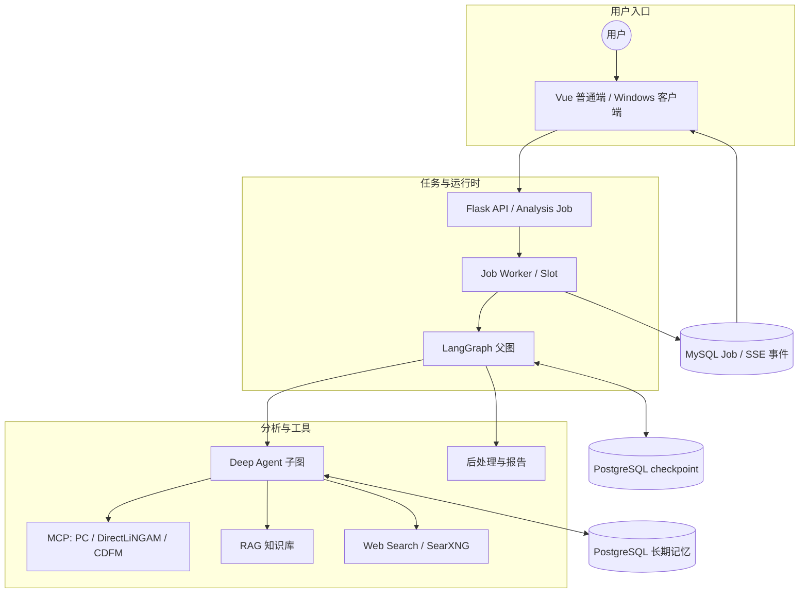
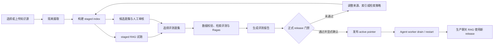

[简体中文](README.md) | [English](README_EN.md)


<p align="center">

</p>

<h1 align="center">
CausalAgent
</h1>

<p align="center">
<em>新一代因果分析智能体</em>
</p>

<p align="center">
    <a href="#">
      
    </a>
    <a href="#">
      
    </a>
    <a href="#">
      
    </a>
    <a href="#">
      
    </a>
  </p>

  <br>

  <p>

*只需上传你的数据集，Causal-Agent 就能以对话的方式，自动帮你选用因果分析算法，并在生成可交互的对话面板和专业的分析报告。*

> [!IMPORTANT]
> **项目开发中**
> <br>
> 目前 CausalAgent 正在进行核心架构升级,我们正在努力完善功能，**请点击右上角 Star ⭐ 关注后续更新！**

## 目录

- [目录](#目录)
- [WHAT IS CausalAgent](#what-is-causalagent)
- [WHY CausalAgent](#why-causalagent)
- [技术栈](#技术栈)
- [用户功能](#用户功能)
  - [用户端展示](#用户端展示)
  - [核心功能](#核心功能)
  - [Agent 运行流程](#agent-运行流程)
  - [深度分析 Agent](#深度分析-agent)
  - [预处理](#预处理)
  - [因果分析（MCP）](#因果分析mcp)
  - [知识库（RAG）](#知识库rag)
  - [联网搜索](#联网搜索)
  - [后处理](#后处理)
  - [报告生成](#报告生成)
- [快速开始 | Quick Start](#快速开始--quick-start)
  - [可访问入口](#可访问入口)
  - [最小配置](#最小配置)
  - [Docker部署](#docker部署)
- [管理员与开发者](#管理员与开发者)
  - [管理员端展示](#管理员端展示)
  - [数据库生产化配置](#数据库生产化配置)
  - [管理员后台](#管理员后台)
  - [日志系统](#日志系统)
    - [开发环境启动](#开发环境启动)
  - [RAG评测工作台](#rag评测工作台)
  - [普通端前端（Vue）](#普通端前端vue)
  - [后端单元测试](#后端单元测试)
  - [windows部署](#windows部署)
- [技术文档](#技术文档)
- [贡献](#贡献)
- [Star History](#star-history)
- [项目结构](#项目结构)


## WHAT IS CausalAgent

**新一代因果分析智能体**: CausalAgent 是一个集成了AGENT的因果分析工具，它能够自动识别因果关系，生成专业的分析报告，并提供可交互的因果图谱。

**缩减因果分析门槛**：什么是因果？为什么需要因果分析？简单来说，[因果分析](https://zh.wikipedia.org/wiki/%E5%9B%A0%E6%9E%9C%E6%8E%A8%E6%96%B7)就是对真实世界数据进行逻辑分析。

## WHY CausalAgent

| 特性 | 说明 |
| :--- | :--- |
| **Agent 驱动** | 基于 LangGraph 父图编排分析节点、工具阶段与子图，自动路由任务。 |
| **Deep Agent 分析** | 预处理之后由 Deep Agent 子图自己规划算法调用、检索工具和结果取舍，并用固定预算限制模型与工具调用次数。 |
|  **动态图谱** | 摒弃静态图片，生成可交互的 Network 图谱，支持节点拖拽、点击追问。 |
|  **论文实时搜索** | SearXNG 实时搜索，获取最新论文与时事。 |
|  **MCP 架构** | 采用MCP，将核心逻辑与工具解耦，极易扩展新算法。 |
|  **RAG 增强** | 内置因果推断领域的专业知识库，确保生成的分析报告学术性与严谨性并存，提供个性化的rag评测桌面，定制化rag服务 |
## 技术栈

| 类别 | 技术组件 |
| :--- | :--- |
| **Agent 与模型** | LangGraph、Deep Agents、LangChain、MCP |
| **RAG 与搜索** | ChromaDB、BM25S、Ragas、SearXNG |
| **后端与数据** | Flask、MySQL、PostgreSQL、Alembic |
| **前端** | Vue 3、TypeScript、Pinia、Vite、vis-network、WebView2 |
| **可观测性** | Grafana Alloy、Loki、Grafana |
| **运行与发布** | Docker Compose、GitHub Actions |

## 用户功能

### 用户端展示
<p align="center">
  
</p>
<p align="center">
  
</p>
<p align="center">
  
</p>

### 核心功能

CausalAgent 的整体因果分析流程可以抽象为：**用户上传数据 → 预处理与数据体检 → 因果结构学习 → 后处理与质量提升 → 报告与可视化输出**。下面按模块进行说明。

### Agent 运行流程

系统不是由多个彼此独立的 Agent 拼接而成，而是由一个 LangGraph 父图编排预处理、Deep Agent 子图、终态校验和报告节点，并由独立 worker 执行 Job：



### 深度分析 Agent

*预处理完成后，由 Deep Agent 子图自己决定调用哪些算法和检索工具，并对结果做出取舍*

- **显式状态边界**：父图只向子图投影问题、数据画像、分析参数和必要输入消息；子图返回时只带回算法结果、工具调用账本、RAG 与联网搜索证据、结构化决策和报告所需的摘要。完整消息、子图内部字段和中间计划不会回写到父图状态。
- **独立执行身份**：父子图共用同一套 PostgreSQL checkpoint，但使用不同的 thread 和 namespace，并额外保存由 Job、attempt、lease 与冻结输入身份组成的执行范围；范围不匹配时从父图的最小输入重新开始，不会复用旧的执行结果。
- **工具编排**：模型看到的是由本地 AlgorithmSpec 生成的 function tools，默认启用 PC、DirectLiNGAM 与 CDFM；同一轮响应里的算法调用按 `requires/produces` 分层，互不依赖的调用可以并行，受单 Job 并发和工具总预算约束。运行时不会调用远端 `list_tools()` 动态扩展模型工具。
- **长期记忆**：用户偏好和研究背景保存在 PostgreSQL Store（与 Job checkpoint 分开），模型只能写 `/memories/preferences.md` 和 `/memories/research_background.md`，其他写入一律拒绝；用户删除后由清理 worker 一并删除对应命名空间。
- **有界预算**：模型调用次数、工具调用次数、递归深度、工具节点超时和单 Job 并行工具数都有固定上限，超出后走受控失败路径。
- **终态校验（FinalizationGate）**：该节点不调用模型，只检查最终决策引用的算法结果是否存在、算法结果与工具调用账本是否一致，以及结果是否属于当前 Job、attempt、lease 和冻结输入。第一次校验失败会把具体违反的引用规则交回子图修正一次，第二次仍失败则降级为只基于已验证输入的报告，不公开未经校验的选择。
- **取消与超时**：Job 心跳丢失或收到取消时，worker 停止本地等待，并通过独立的 control lane 发送签名取消，只终止目标算法调用，不影响并行的其他调用。


### 预处理
*进行基本的数据建模，对数据进行可视化分析，并为后续因果分析做「体检与筛选」*

- **数据概览**：统计数据集的行数、列数和所有字段名，生成统一的表结构摘要，帮助快速理解数据规模与字段含义。
- **列级体检与类型推断**：逐列分析缺失率、唯一值、是否常数列，自动识别连续变量、分类变量、时间变量、疑似 ID 等，并给出每一列在因果分析中的适用性评级（如 *excellent / good / warning*）。
- **质量诊断与因果友好度评估**：汇总整体缺失率，标记高缺失列和常数列，识别高基数分类、疑似 ID 等问题字段，并按适用性分组出「优先用于因果分析」的候选变量列表。
- **可视化摘要**：通过直方图、箱线图、相关性热力图等可视化方式，辅助发现明显异常值和潜在共线性问题。

### 因果分析（MCP）
*基于 MCP（Model Context Protocol）快速迭代因果算法*

- **可插拔算法框架**：通过 MCP 将因果发现与估计算法以「工具」形式解耦，便于在不改动 Agent 主逻辑的前提下扩展/更换算法库。
- **当前支持**：
  - PC 算法（基于条件独立检验的因果结构学习）。
  - DirectLiNGAM（面向连续数值数据的线性非高斯无环因果发现，输出因果顺序与带权有向图）。使用结果时需满足误差相互独立、无潜在混杂等模型假设，边权表示模型估计系数，不等同于实验验证。
  - CDFM（面向连续数值表格数据的零样本因果图推断）。只向模型公开可选的 `threshold`，模型路径、运行设备和标准化策略由算法服务固定；缺失值按 CDFM 的掩码规则传递，分类变量不适用，输出只代表本次模型推断，不构成准确率或生产能力证明。
- **保留但不默认启用**：OLC 的实现（算法规格、适配器、执行器与算法代码）仍保留在仓库中，但不进入默认工具面。
- **规划中**：
  - FCI 等含潜在混杂的结构学习算法；
  - 因果效应估计（ATE/CATE）与反事实分析等模块。

### 知识库（RAG）
*通过多模态知识库、混合检索与受控 release，为报告和问答提供专业支撑*

- **运行方式**：仓库提供受版本控制的正式 active release，生产查询从 release manifest 加载索引与 embedding 身份；部署时仍需配置匹配的 Embedding API。
- **检索能力**：使用 ChromaDB 向量检索与 BM25S 稀疏检索，并支持 PDF、文本、表格和图片等多模态摄取。
- **知识来源**：使用大量因果推断相关书籍与论文的 PDF / TXT 文档构建，涵盖经典因果图论、干预推断、工具变量、面板因果等主题。
- **典型能力**：
  - 在生成报告时，自动检索相关理论和方法描述，为结论补充严谨的文献背景；
  - 支持面向初学者的「概念解释」，例如“什么是混杂变量”“为什么需要随机试验”等。
- **个性化检索评测**
  - 进入rag检索评测页面，可以自定义rag检索内容，实现个性化知识库定义。

### 联网搜索

用户可以在发起分析前开启联网搜索。Web Search 子图通过 SearXNG 聚合 arXiv、Crossref 与 OpenAlex 等学术来源，并把受限数量的引用随报告公开；规划、检索或解析失败时会返回统一降级结果，不阻断主分析流程。

### 后处理
*对因果图进行后处理，包括环路检测、边合理性评估等，提高因果结构的可解释性与可靠性*

- **环路检测与修正**：检查学习得到的因果图中是否存在违背 DAG（有向无环图）假设的环路；若发现异常，则调用 LLM 辅助判断合理的断边方案，给出修正建议。
- **边评估与置信度分析**：对每一条因果边进行强度或置信度评估，结合数据统计特征和领域常识，对明显不合理的边进行标记与修正建议。
- **结构约束与业务先验融合**：在后处理阶段支持引入业务先验（如「变量 A 不可能被 B 因果影响」），从而得到更符合领域知识的因果图。

### 报告生成
*根据后处理结果生成面向业务方与研究者的专业报告，并配套交互式可视化*

- **自动生成结构化报告**：围绕「分析背景 → 数据概况 → 方法说明 → 因果发现 → 结论与建议 → 局限性」等章节自动撰写自然语言报告。
- **结构化报告渲染**：模型只产出章节、Markdown 文本和资源引用，图表数据、因果图模型、来源和证据由后端注入并校验；普通端按块类型分别渲染章节、图表和因果图，引用不存在的资源时显示受控提示，不会让整页崩溃。
- **交互式因果图谱**：基于 vis-network 等前端组件生成可交互的因果图，支持节点拖拽、缩放、查看变量说明、点击追问等操作。

## 快速开始 | Quick Start

### 可访问入口

默认开发 Compose 启动后，可以访问：

| 功能 | 地址 | 说明 |
| --- | --- | --- |
| 官网 | [http://127.0.0.1:5001/](http://127.0.0.1:5001/) | 产品介绍、公开文档、更新日志和登录注册入口 |
| 登录页 | [http://127.0.0.1:5001/auth/sign-in](http://127.0.0.1:5001/auth/sign-in) | 统一登录入口，按权限回到工作区、评测台或管理后台 |
| 用户工作区 | [http://127.0.0.1:5001/dashboard](http://127.0.0.1:5001/dashboard) | 登录后上传数据、发起分析和查看报告 |
| RAG 评测台 | [http://127.0.0.1:5001/rag-eval](http://127.0.0.1:5001/rag-eval) | 知识源摄取、staged index、评测与 release 管理，仅管理员可访问 |
| 管理后台 | [http://127.0.0.1:5001/admin/database](http://127.0.0.1:5001/admin/database) | 管理员登录后的默认入口 |
| Grafana | [http://127.0.0.1:3000](http://127.0.0.1:3000) | 日志查询和仪表盘 |

注：官网、用户工作区、RAG 评测台和管理后台是四个独立构建的前端；RAG 评测台是隔离的知识库构建、评测和发布工作台，只有拥有 `rag_eval.access` 权限的账号能打开。

### 最小配置

复制 [`.env.example`](.env.example) 后，至少按启用能力检查以下配置；不要把真实密码或 API key 提交到 Git：

- 基础服务：`SECRET_KEY`、MySQL 账号、`CHECKPOINT_POSTGRES_PASSWORD`。
- Chat 模型：`API_KEY`、`BASE_URL`、`MODEL`。
- 深度分析 Agent：`DEEP_AGENT_MODEL`、`DEEP_AGENT_BASE_URL`、`DEEP_AGENT_API_KEY`、`DEEP_AGENT_CONTEXT_WINDOW_TOKENS`；上下文窗口必须显式设置，不会静默回退。
- 算法服务：`CAUSAL_MCP_SERVICE_TOKEN`、`CAUSAL_MCP_SIGNING_KEY_CURRENT`，轮换期间还要保留 `CAUSAL_MCP_SIGNING_KEY_PREVIOUS`；CDFM 的权重位置可用 `CDFM_MODEL_PATH` 指定。
- RAG 查询：`EMBEDDING_API_KEY`、`EMBEDDING_BASE_URL`、`EMBEDDING_MODEL`，且必须与 active release manifest 匹配。
- 日志界面：`GRAFANA_ADMIN_PASSWORD`。
- 联网搜索：Compose 默认使用 `WEB_SEARCH_PROVIDER=searxng` 和内部 `SEARXNG_URL`，通常无需额外修改。

完整配置和运行边界见 [`Document/development/setup.md`](Document/development/setup.md) 与 [`Document/development/deployment.md`](Document/development/deployment.md)。

### Docker部署
当前项目已经提供了完整的多阶段 `Dockerfile`，会先用 Node 24 分别构建普通端 Vue 和管理员 Vue，再生成仅包含 Python 运行时与静态产物的应用镜像；暂未在公网镜像仓库发布官方镜像。
如果你已安装 Docker，可以在本地根据下面的步骤自行构建并运行镜像。


1. 安装docker并且gitclone项目
```bash
git clone https://github.com/Heyflyingpig/CausalAgent
cd CausalAgent
```

2. 创建并填写.env文件
```bash
cp .env.example .env
```

3. 在项目根目录运行docker-compose
```bash
docker compose -f docker-compose.yml up -d
```

`docker compose ... up -d` 会在 app、worker、monitor 和 cleanup worker 启动前，
自动运行一次性 `db-bootstrap`。它依次执行 MySQL 建库、Alembic migration 和
LangGraph 官方 PostgreSQL setup。若需要手动重跑该初始化入口，可执行：

```bash
docker compose -f docker-compose.yml run --rm db-bootstrap
```

请先在 `.env` 设置非空的 `CHECKPOINT_POSTGRES_PASSWORD`。
`checkpoint-cleanup` 仍是独立的常驻 worker，用于消费跨库清理 outbox。
`app` 负责管理员 checkpoint 摘要读取，`monitor` 负责 PostgreSQL quick/deep
检查，因此两者也必须取得相同的 `CHECKPOINT_POSTGRES_*` 配置。生产 Compose
同样包含 PostgreSQL、bootstrap、worker、monitor 和 cleanup 服务。

全新空库不需要运行升级前审计。只有旧库尚未建立目标外键、且即将执行添加这些外键的迁移时，才先运行：

```bash
docker compose -f docker-compose.yml run --rm app python Database/audit_before_db_upgrade.py
```

> [!IMPORTANT]
> 仓库已包含正式 active RAG release，但部署环境仍须提供与 manifest 匹配的 Embedding API 配置。readiness 检查失败时，worker 会继续启动并把 RAG 安全降级为不可用。

## 管理员与开发者

前面的章节面向普通用户和首次运行；本节集中说明管理员入口、数据库、日志、测试和桌面发布。

### 管理员端展示

<p align="center">
  
</p>

### 数据库生产化配置

主从开发：

如果你已经启动过 `mysql-primary` 或 `mysql-replica`，修复后要使用新的空 volume 重建；否则 `/docker-entrypoint-initdb.d` 初始化脚本不会重新执行。

主从模式下数据库账号按职责拆分：

- 写账号：`MYSQL_WRITE_USER` / `MYSQL_WRITE_PASSWORD`，用于应用写主库、Alembic 迁移和启动就绪检查；缺失时兼容回退到 `MYSQL_USER` / `MYSQL_PASSWORD`。
- 读账号：`MYSQL_READ_USER` / `MYSQL_READ_PASSWORD`，用于 `get_read_connection()` 的主库强一致读和从库弱一致读；除业务库 `SELECT` 外，仅额外授予 `performance_schema.events_statements_summary_by_digest` 的表级 `SELECT`，供高负载 SQL digest 摘要使用；缺失时兼容回退到 `MYSQL_USER` / `MYSQL_PASSWORD`。
- 复制状态检查账号：`MYSQL_REPLICA_STATUS_USER` / `MYSQL_REPLICA_STATUS_PASSWORD`，只用于读取 `SHOW REPLICA STATUS`；缺失或不可用时，`eventual` 读安全回退主库读连接。
- 复制通道账号：`MYSQL_REPLICATION_USER` / `MYSQL_REPLICATION_PASSWORD`，只用于 MySQL 主从复制链路，不参与应用业务查询。


### 管理员后台

管理员后台提供业务概览、用户、会话、任务、文件、数据库看板、采集配置和数据库审计。数据库看板通过 URL 查询参数在“数据库运行状态 / Cleanup Worker / Outbox 队列”三段视图间切换；用户删除后可从持续可见的 checkpoint 清理进度区跳转到对应 Operation ID 的 Outbox 排查。普通用户仍进入聊天页面，已启用的管理员登录后进入 `/admin/database`。

管理员仍默认进入 `/admin/database`，也可从后台进入普通聊天界面；聊天页只访问当前账号自己的会话、文件和任务，并向管理员提供返回后台的入口。管理员主动访问 `/` 时不会被再次强制送回后台。

未登录管理页面只保留白名单内的安全回跳；普通用户直访管理页面会得到 `403`。`POST /api/login` 仅在内部 `next` 通过服务端白名单校验后返回 `redirect_to`。

首次使用前，先完成数据库迁移和管理员前端构建，然后把一个已经注册且已启用的用户提升为管理员：

```bash
# Docker 运行
docker compose -f docker-compose.yml run --rm app python -m app.auth.admin_cli promote <username>
```

管理员系统的部署、开发、API、安全边界和测试说明统一放在 [`Document/admin/`](Document/admin/README.md)。其中：

- [API 契约](Document/admin/api.md)
- [开发与部署](Document/admin/development.md)
- [测试说明](Document/admin/testing.md)

### 日志系统

运行时日志链路为：

```text
app / worker / monitor / MCP / RAG worker
    → 结构化 JSON 日志
    → Grafana Alloy
    → Loki
    → Grafana Dashboard
```

运行时代码使用受控事件目录，并通过 request、job、session 和 worker slot 等字段关联请求。原始 prompt、文件正文、API key、Token 和 Cookie 等敏感内容不得进入日志；完整事件、降噪与脱敏规则见 [`Document/development/observability.md`](Document/development/observability.md)。

#### 开发环境启动

先在 `.env` 中设置非空的 `GRAFANA_ADMIN_PASSWORD`，然后从仓库根目录执行配置校验、Alloy语法校验和完整开发启动：

```bash
docker compose -f docker-compose.yml config --quiet
docker compose -f docker-compose.yml pull loki alloy grafana
docker compose -f docker-compose.yml run --rm --no-deps alloy validate /etc/alloy/config.alloy
docker compose -f docker-compose.yml up -d
docker compose -f docker-compose.yml ps
```

打开 [http://127.0.0.1:3000](http://127.0.0.1:3000) 进入 Grafana，使用 `GRAFANA_ADMIN_USER`（默认值为 `admin`）和 `.env` 中设置的密码登录。Loki 数据源和 CausalAgent 日志仪表盘会由 Compose 自动 provision。需要直接查看容器输出时执行：

```bash
docker compose -f docker-compose.yml logs -f app worker monitor alloy loki grafana
```

停止服务建议使用 `docker compose -f docker-compose.yml stop`，这样会保留 Loki、Grafana 和Alloy positions 命名卷。不要使用 `down -v` 代替停止操作，否则会删除日志查看拓扑的持久化数据。
修改 `observability/alloy/config.alloy` 后，必须重新执行 `alloy validate`，确认通过后再重启Alloy。

[`Document/development/observability.md`](Document/development/observability.md)，Compose
部署边界见 [`Document/development/deployment.md`](Document/development/deployment.md)。

### RAG评测工作台

<p align="center">
  
</p>
RAG 评测工作台面向管理员和 RAG 维护人员，用于在不影响当前生产知识库的前提下，完成知识源摄取、隔离索引构建、检索试跑、题集治理、Ragas 评测和正式 release 发布。详细文档请看： [`Document/architecture/rag-evaluation.md`](Document/architecture/rag-evaluation.md)

页面主要分为工作索引、候选题集、评测中心、正式发布和报告管理等区域。工作台入口为 [http://127.0.0.1:5001/rag-eval](http://127.0.0.1:5001/rag-eval)，页面和 `/api/rag_eval` 接口都要求 `rag_eval.access`，未登录访客会先跳到登录页。



### 前端（Vue）

同源下运行四个互相独立的 Vue 3 + TypeScript 工程，都不加入根级 npm workspace，构建产物都由 Flask 在同源路径提供：官网 `website-frontend/`（`/site-assets/`）、用户工作区 `chat-frontend/`（`/dashboard-assets/`）、RAG 评测台 `app/rag_eval/frontend/`（`/rag-eval/`）和管理员前端 `admin-frontend/`（`/admin/`）。缺少任一构建产物时，对应该前端的页面入口返回 503 和 request ID，既不回退到其它前端，也不返回半成品资源。

本地开发在仓库根目录执行一条命令，脚本会为选中的前端各开一个窗口运行 Vite：

```powershell
.\scripts\dev_frontends.ps1                          # 四个前端全部启动
.\scripts\dev_frontends.ps1 -Frontends website,chat  # 只启动官网和普通端
.\scripts\dev_frontends.ps1 -Frontends rag -Install  # 先执行 npm ci 再启动
```

脚本只使用 PowerShell 和 npm，`-WhatIf` 只打印将要执行的操作，`-Install` 先执行 `npm ci`；单独开发某个前端时仍可直接进入该目录执行 `npm ci` 和 `npm run dev`。端口、开发地址和跳过条件见 [`Document/development/setup.md`](Document/development/setup.md)。

官网开发服务器使用 5175 端口和 `/site-assets/` base，用户工作区使用 5174 端口和 `/dashboard-assets/` base，两者的 Vite 都把 `/api` 代理到 `http://127.0.0.1:5001`。在 `.env` 设置 `WEBSITE_VITE_DEV_SERVER_URL=http://127.0.0.1:5175` 或 `CHAT_VITE_DEV_SERVER_URL=http://127.0.0.1:5174` 后，Flask 会把对应页面交给 Vite；未登录访问 `/dashboard` 会跳到 `/auth/sign-in`。官网和用户工作区的代码检查与生产构建都用 `npm run check`，RAG 评测台前端使用 `npm run typecheck`、`npm test` 和 `npm run build`。

详细的状态约束见 [`Document/development/chat-frontend.md`](Document/development/chat-frontend.md) 和 [`Document/development/website-frontend.md`](Document/development/website-frontend.md)。

### 后端单元测试

仓库提供独立的 `docker-compose.test.yml`，用于按需创建一次性单元测试容器。测试镜像预装项目 Python 依赖和 `pytest`，不连接 MySQL，禁用网络；当前源码以只读方式挂载到容器，因此修改代码后可以直接重新运行测试，无需重建镜像。

首次使用或测试依赖变化后构建测试镜像：

```bash
docker compose -f docker-compose.test.yml build unit-test
```

运行全部后端单元测试，测试结束后自动删除本次容器：

```bash
docker compose -f docker-compose.test.yml run --rm unit-test
```

运行指定测试文件：

```bash
docker compose -f docker-compose.test.yml run --rm unit-test python -m pytest -p no:cacheprovider tests/unit/agent/test_agent_state_routing.py
```

需要在相同环境内排查导入或依赖问题时，可以临时进入 Shell；退出后容器仍会自动删除：

```bash
docker compose -f docker-compose.test.yml run --rm unit-test sh
```

当前测试只保证 `tests/unit`；集成测试和隔离主从 E2E 的执行边界见 [`tests/README.md`](tests/README.md)。


### windows部署

CausalAgent已支持 Windows 桌面客户端：`Run_causal.py` 只启动 WebView2 Edge Chromium 窗口，并加载与浏览器相同的 CausalAgent 页面。

也可以进入release中，下载对应tag版本的桌面端

创建独立桌面环境并检查 WebView2 Runtime：

```powershell
python -m venv .venv-desktop
.\.venv-desktop\Scripts\python.exe -m pip install -r .\windows-client\requirements-desktop.txt
.\.venv-desktop\Scripts\python.exe .\Run_causal.py --check-environment
```

开发时先启动现有 Flask 服务，再运行桌面壳。URL 优先级为命令行 `--url` > `CAUSALAGENT_DESKTOP_URL` > `http://127.0.0.1:5001/`：

```powershell
$env:CAUSALAGENT_DESKTOP_URL = "http://127.0.0.1:5001/"
.\.venv-desktop\Scripts\python.exe .\Run_causal.py
```

Release 包在构建时嵌入正式 HTTPS origin，强制关闭 debug 和开发者工具；构建与 Windows 验收命令见 [`windows-client/README.md`](windows-client/README.md)、[`Document/development/setup.md`](Document/development/setup.md) 和 [`Document/development/testing.md`](Document/development/testing.md)。

## 技术文档

根 README 只提供项目概览和常用入口，具体技术事实统一由 [`Document/README.md`](Document/README.md) 导航：

- 系统、Agent 与 RAG 架构：[`Document/architecture/`](Document/architecture/overview.md)
- 普通用户与 RAG API：[`Document/api/`](Document/api/conventions.md)
- 数据库、迁移与 checkpoint：[`Document/database/`](Document/database/overview.md)
- 开发、测试、部署与可观测性：[`Document/development/`](Document/development/setup.md)
- 管理员模块：[`Document/admin/`](Document/admin/README.md)

## 贡献
欢迎提交 Issue 和 Pull Request！

1. Fork 本项目

2. 从 `develop` 新建工作分支，例如 `feat(rag)/cache`

3. 提交信息与 Pull Request 标题使用 `keyword(function):description` 格式

   支持的 keyword 包括 `feat`、`fix`、`docs`、`refactor`、`test`、`chore`、`ci`、`build`、`perf` 和 `revert`，例如 `fix(chat):修复会话删除异常`。

4. 向 `develop` 新建 Pull Request；只有 `develop` 可以向 `main` 发起合并请求

5. 等待 `Python syntax`、`Light tests` 和 `Pull request policy` 检查通过后再合并

新建 Issue 时请使用仓库提供的 [`Issue Form`](.github/ISSUE_TEMPLATE/issue.yml)，按模板填写背景、问题描述、预期结果、复现步骤、验收标准和环境信息。除附件外的字段为 GitHub 原生必填项，但不限制填写内容；普通贡献者不能选择空白 Issue。

## Star History
<a href="https://www.star-history.com/?repos=Heyflyingpig%2FCausalAgent&type=date&legend=top-left">
 <picture>
   <source media="(prefers-color-scheme: dark)" srcset="https://api.star-history.com/chart?repos=Heyflyingpig/CausalAgent&type=date&theme=dark&legend=top-left&sealed_token=vS9LuCPAcO5HBRJ7MqLOBVKGWvmIC8oGUNMsERduenNH5V5akK0TIWWWQljUSlpxn51m9ROc4eqMCHAEbm0hbW_s66HzGJPzNzE_FxjQXN2e1X7bTiWdq9DKNsjtUwfG6z_5jr-PQcnDsaPoirqPbtSM1xAJvkdffet1KAGVfBKq777hNOA2qhwHt2Hp" />
   <source media="(prefers-color-scheme: light)" srcset="https://api.star-history.com/chart?repos=Heyflyingpig/CausalAgent&type=date&legend=top-left&sealed_token=vS9LuCPAcO5HBRJ7MqLOBVKGWvmIC8oGUNMsERduenNH5V5akK0TIWWWQljUSlpxn51m9ROc4eqMCHAEbm0hbW_s66HzGJPzNzE_FxjQXN2e1X7bTiWdq9DKNsjtUwfG6z_5jr-PQcnDsaPoirqPbtSM1xAJvkdffet1KAGVfBKq777hNOA2qhwHt2Hp" />
   
 </picture>
</a>

## 项目结构

```
.
├── CausalAgent.py              # Flask Web 入口
├── Run_causal.py               # Windows WebView2 启动入口
├── app/                        # Web、认证、Job、管理员与 RAG 运行台
│   ├── agent/                  # Job API、SSE 与独立 worker
│   └── rag_eval/               # 隔离摄取、评测与 release 管理
├── Agent/                      # LangGraph、因果工具与知识库
│   ├── causal_agent/           # 父图、节点、路由与子图
│   ├── deep_agent/             # 深度分析子图、长期记忆与终态校验
│   ├── deep_agent_tools/       # 算法 Spec、Adapter、领域工具与事件适配
│   ├── CausalAgentMCP/         # MCP 因果算法服务
│   └── knowledge_base/         # RAG runtime、多模态索引与评测
├── Database/                   # MySQL、PostgreSQL、迁移与监控
├── observability/              # 结构化日志、事件目录与 Alloy 配置
├── searxng/                    # 联网搜索配置与初始化
├── website-frontend/           # Vue 官网前端（公开页面与登录注册）
├── chat-frontend/              # Vue 普通用户应用前端（/dashboard）
├── admin-frontend/             # Vue 管理员前端（/admin）
├── windows-client/             # Windows 客户端、构建与 smoke 测试
├── config/                     # 应用与 RAG 路径配置
├── deploy/                     # staging/production 部署资源
├── scripts/                    # 开发、发布、验收与诊断脚本
├── Document/                   # 当前技术事实库
├── tests/                      # unit、integration、e2e 与 smoke
├── docker-compose*.yml         # 开发、测试、预发和生产拓扑
└── .github/workflows/          # CI 与 Windows release 工作流
```
