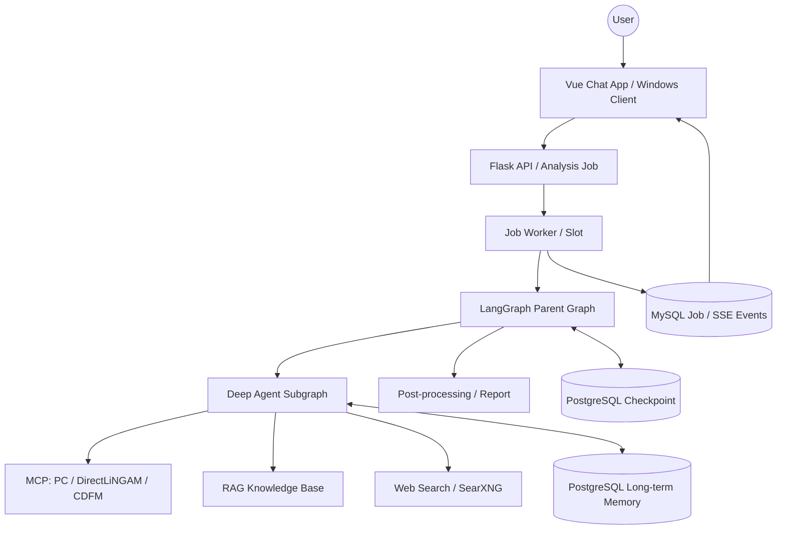

[English](README_EN.md) | [简体中文](README.md)

<p align="center">
  
</p>

<h1 align="center">
CausalAgent
</h1>

<p align="center">
  <em>Next-generation causal analysis agent</em>
</p>

<p align="center">
    <a href="#">
      
    </a>
    <a href="#">
      
    </a>
    <a href="#">
      
    </a>
    <a href="#">
      
    </a>
  </p>

<br>

*Upload your dataset, and CausalAgent will automatically select suitable causal analysis algorithms for you, generate an interactive dialogue interface, and produce a professional analysis report.*

> [!IMPORTANT]
> **Project in active development**
> We are upgrading the core architecture of CausalAgent. Features are evolving quickly. **Please Star the repo to follow future updates.**

## Table of Contents

- [Table of Contents](#table-of-contents)
- [What is CausalAgent](#what-is-causalagent)
- [Why CausalAgent](#why-causalagent)
- [Tech Stack](#tech-stack)
- [User Features](#user-features)
  - [User Showcase](#user-showcase)
  - [Agent Runtime](#agent-runtime)
  - [Deep Agent](#deep-agent)
  - [Core Capabilities](#core-capabilities)
- [Quick Start](#quick-start)
  - [Service URLs](#service-urls)
  - [Minimum Configuration](#minimum-configuration)
  - [Docker Deployment](#docker-deployment)
- [Administration and Development](#administration-and-development)
  - [Administrator Console](#administrator-console)
  - [Observability](#observability)
  - [User Frontend (Vue)](#user-frontend-vue)
  - [Backend Tests](#backend-tests)
  - [Windows Deployment](#windows-deployment)
- [Technical Documentation](#technical-documentation)
- [Contributing](#contributing)
- [Project Structure](#project-structure)
- [Star History](#star-history)

## What is CausalAgent

**A new generation causal analysis agent.** CausalAgent uses a LangGraph parent graph to orchestrate analysis nodes, tool stages, and subgraphs for end-to-end causal analysis on tabular data.

You only need to upload your data. CausalAgent will:

- Inspect and profile your dataset.
- Discover causal structures.
- Perform post-processing and quality checks.
- Generate interactive causal graphs and a structured, human-readable report.

## Why CausalAgent

| Feature | Description |
| :--- | :--- |
| **Agent-driven** | A LangGraph parent graph automatically routes analysis nodes, tool stages, and subgraphs. |
| **Deep Agent analysis** | After pre-processing, a Deep Agent subgraph plans algorithm calls, retrieval tools, and result selection under a fixed budget. |
| **Dynamic causal graphs** | Instead of static images, CausalAgent renders interactive network graphs. You can drag nodes, zoom, and click to inspect details. |
| **MCP-based architecture** | Uses **Model Context Protocol (MCP)** to decouple core logic from tools, making it easy to extend new algorithms. |
| **RAG enhanced** | A domain-specific knowledge base for causal inference is integrated to ensure the generated reports are rigorous and well grounded. |

## Tech Stack

| Category | Components |
| :--- | :--- |
| **Agent and models** | LangGraph, Deep Agents, LangChain, MCP, OpenAI-compatible Chat / Embedding APIs |
| **RAG and search** | ChromaDB, BM25S, Ragas, SearXNG |
| **Backend and data** | Flask, MySQL, PostgreSQL, Alembic |
| **Frontend** | Vue 3, TypeScript, Pinia, Vite, vis-network, WebView2 |
| **Observability** | Grafana Alloy, Loki, Grafana |
| **Runtime and release** | Docker Compose, GitHub Actions |

## User Features

### User Showcase

<p align="center">
  
</p>
<p align="center">
  
</p>
<p align="center">
  
</p>

### Agent Runtime

The parent graph orchestrates pre-processing, the Deep Agent subgraph, finalization checks, and the report node; an independent worker executes every job.



Users can enable Web Search per analysis job. If RAG or Web Search is temporarily unavailable, the corresponding subgraph returns a controlled degradation result so that the main analysis can continue.

### Deep Agent

After pre-processing, a Deep Agent subgraph decides which algorithms and retrieval tools to call and how to select among the results.

- **Explicit state boundary**: The parent graph projects only the question, data profile, analysis parameters, and required input messages into the subgraph. The subgraph returns only algorithm results, the tool-call ledger, RAG and Web Search evidence, structured decisions, and report summaries. Full messages, internal fields, and intermediate plans never flow back into the parent state.
- **Separate execution identity**: Parent and child graph share the PostgreSQL checkpointer but use different threads and namespaces, plus an execution scope built from the job, attempt, lease, and frozen input identity. A scope mismatch restarts from the minimal parent input instead of reusing earlier artifacts.
- **Tool orchestration**: Models see LangChain function tools generated from the local `AlgorithmSpec` registry. PC, DirectLiNGAM, and CDFM are enabled by default. Algorithm calls inside one model response are layered by `requires`/`produces`: independent calls run in parallel under per-job concurrency and tool-budget limits. The runtime never calls a remote `list_tools()` to extend the model tool set.
- **Long-term memory**: User preferences and research background live in a PostgreSQL Store that is separate from job checkpoints. The model may only write `/memories/preferences.md` and `/memories/research_background.md`; every other write is denied, and the cleanup worker removes the namespace when the user is deleted.
- **Bounded budget**: Model calls, tool calls, recursion depth, tool-node timeout, and per-job parallel tools all have fixed upper bounds; exceeding them follows a controlled failure path.
- **Finalization check**: The finalization gate calls no model. It verifies that references in the final decision exist, that algorithm results match the tool-call ledger, and that provenance belongs to the current job, attempt, lease, and frozen input. The first failed check returns the exact violated reference rule to the subgraph for one revision; a second failure degrades to a report based only on verified inputs, without publishing unverified selections.
- **Cancellation**: When a job heartbeat is lost or a cancel arrives, the worker stops waiting locally and sends a signed cancel over a dedicated control lane, which terminates only the targeted algorithm call.

### Core Capabilities

The overall pipeline of CausalAgent can be summarized as:

**Upload data → Pre-process & data health check → Causal structure learning → Post-processing & quality enhancement → Report & visualization.**

#### Pre-processing

- **Data overview**: Count rows, columns, and field names to quickly summarize table structure.
- **Column-level profiling & type inference**: Detect missing rate, unique values, constant columns; infer continuous, categorical, time-like, ID-like columns, and rate their suitability for causal analysis.
- **Quality diagnosis**: Summarize overall missingness, mark high-missing or constant columns, and identify problematic fields.
- **Visual summaries**: Histograms, boxplots, correlation heatmaps, etc., to reveal outliers and collinearity.

#### Causal Analysis (MCP)

- **Pluggable algorithm framework**: Through MCP, causal discovery and estimation algorithms are wrapped as "tools" and can be swapped or extended without changing the Agent logic.
- **Currently supported**:
  - PC algorithm for causal structure learning based on conditional independence tests.
  - DirectLiNGAM for linear, non-Gaussian, acyclic continuous data under its explicit model assumptions.
  - CDFM for zero-shot causal graph inference on continuous numeric tabular data. Only an optional `threshold` is exposed to the model; the checkpoint path, device, and standardization policy are fixed by the algorithm service. Missing values follow the CDFM mask rules, categorical variables are not accepted, and the output represents this model inference only, without any accuracy or production-capability claim.
- **Kept but disabled by default**: The OLC implementation (specification, adapter, runner, and algorithm code) remains in the repository but is not part of the default tool surface.
- **Planned**:
  - FCI and other algorithms with latent confounders.
  - Causal effect estimation (ATE/CATE) and counterfactual analysis.

#### Knowledge Base (RAG)

- **Runtime release**: The repository provides a version-controlled active release. Production queries load index and embedding identity from its manifest and require a matching Embedding API configuration.
- **Hybrid retrieval**: ChromaDB dense retrieval and BM25S sparse retrieval support multimodal PDF, text, table, and image ingestion.
- **Knowledge sources**: Books and papers on causal inference (PDF/TXT), covering graphical models, intervention analysis, IV, panel causal analysis, etc.
- **Typical abilities**:
  - Retrieve relevant theory when generating reports to provide academic background.
  - Explain fundamental concepts for beginners (e.g., "What is a confounder?").

If the active release, Embedding API, or worker readiness check is invalid, the Agent marks RAG unavailable and degrades safely. The standalone RAG workbench manages source ingestion, staged indexes, evaluation, and controlled release publishing.

#### Web Search

The optional Web Search subgraph uses SearXNG to aggregate academic results from arXiv, Crossref, and OpenAlex. It exposes a bounded set of references in reports and degrades without aborting the main analysis when planning, search, or parsing fails.

#### Post-processing

- **Cycle detection and repair**: Check whether the learned graph violates the DAG assumption; if cycles appear, LLM-assisted suggestions are used to break edges.
- **Edge evaluation and confidence analysis**: Evaluate strength or confidence of each edge, mark suspicious ones, and provide adjustment suggestions.
- **Business constraints integration**: Allow domain priors such as "A cannot be caused by B" to refine the final graph.

#### Report Generation

- **Automatic structured reports**: Generate reports with sections like background, data overview, methods, findings, conclusions, and limitations.
- **Structured report rendering**: The model produces sections, Markdown text, and resource references only, while chart data, causal graph models, sources, and evidence are injected and validated by the backend. The chat app renders sections, charts, and causal graphs by block type and shows a controlled notice for unknown references instead of breaking the page.
- **Interactive causal graph**: Use frontend components such as vis-network to render a graph that supports drag, zoom and click.

## Quick Start

### Service URLs

After the default development Compose stack starts, use these entry points:

| Function | URL | Purpose |
| --- | --- | --- |
| Website | [http://127.0.0.1:5001/](http://127.0.0.1:5001/) | Product pages, public docs, changelog, and sign-in/sign-up entries |
| Sign-in | [http://127.0.0.1:5001/auth/sign-in](http://127.0.0.1:5001/auth/sign-in) | Shared sign-in entry that returns each account to its permitted area |
| User workspace | [http://127.0.0.1:5001/dashboard](http://127.0.0.1:5001/dashboard) | Upload data, start analyses, and view reports after signing in |
| RAG workbench | [http://127.0.0.1:5001/rag-eval](http://127.0.0.1:5001/rag-eval) | Source ingestion, staged indexes, evaluation, and release management; administrators only |
| Admin console | [http://127.0.0.1:5001/admin/database](http://127.0.0.1:5001/admin/database) | Default entry for authenticated administrators |
| Grafana | [http://127.0.0.1:3000](http://127.0.0.1:3000) | Log search and dashboards |

The website, the user workspace, the RAG workbench, and the admin console are four separately built frontends. The RAG workbench is an isolated build, evaluation, and release workspace and requires the `rag_eval.access` permission; it is not the same as RAG queries inside the normal chat flow.

### Minimum Configuration

Copy [`.env.example`](.env.example), then configure the capabilities you plan to enable. Never commit real passwords or API keys:

- Base services: `SECRET_KEY`, the MySQL accounts, and `CHECKPOINT_POSTGRES_PASSWORD`.
- Chat model: `API_KEY`, `BASE_URL`, and `MODEL`.
- Deep Agent: `DEEP_AGENT_MODEL`, `DEEP_AGENT_BASE_URL`, `DEEP_AGENT_API_KEY`, and `DEEP_AGENT_CONTEXT_WINDOW_TOKENS`; the context window must be set explicitly, because there is no silent fallback.
- Algorithm service: `CAUSAL_MCP_SERVICE_TOKEN` and `CAUSAL_MCP_SIGNING_KEY_CURRENT`, plus `CAUSAL_MCP_SIGNING_KEY_PREVIOUS` during key rotation; `CDFM_MODEL_PATH` selects the CDFM checkpoint.
- RAG queries: `EMBEDDING_API_KEY`, `EMBEDDING_BASE_URL`, and `EMBEDDING_MODEL`; these must match the active release manifest.
- Log UI: `GRAFANA_ADMIN_PASSWORD`.
- Web Search: Compose defaults to `WEB_SEARCH_PROVIDER=searxng` and its internal `SEARXNG_URL`.

See [`Document/development/setup.md`](Document/development/setup.md) and [`Document/development/deployment.md`](Document/development/deployment.md) for the full configuration and runtime boundaries.

### Docker Deployment

The multi-stage `Dockerfile` builds the ordinary-user Vue app and the administrator Vue app with Node 24 first, then produces a Python runtime image that ships only the runtime and static artifacts.

1. Clone the repository:

   ```bash
   git clone https://github.com/Heyflyingpig/CausalAgent
   cd CausalAgent
   ```

2. Create and edit the environment file:

   ```bash
   cp .env.example .env
   ```

3. Start the services:

   ```bash
   docker compose up -d
   ```

   The one-shot `db-bootstrap` service initializes the MySQL schema through
   Alembic and initializes the LangGraph PostgreSQL checkpoint schema before
   the application services start.

> [!IMPORTANT]
> The repository includes a formal active RAG release, but the deployment must provide the matching Embedding API configuration. If readiness fails, the worker still starts and safely marks RAG unavailable.

## Administration and Development

The preceding sections focus on end users and first-time setup. This section collects administrator and developer entry points.

### Administrator Console

<p align="center">
  
</p>

The administrator console covers users, sessions, jobs, files, database status, collection settings, and audit workflows. Complete security, API, deployment, and test boundaries are indexed in [`Document/admin/`](Document/admin/README.md).

### Observability

```text
app / worker / monitor / MCP / RAG worker
    -> structured JSON logs
    -> Grafana Alloy
    -> Loki
    -> Grafana dashboards
```

Runtime events are controlled by the event catalog and correlated with request, job, session, and worker-slot fields. Raw prompts, file contents, API keys, tokens, and cookies must not enter logs. See [`Document/development/observability.md`](Document/development/observability.md) for event, noise-control, and privacy rules.

### Frontends (Vue)

Four standalone Vue 3 + TypeScript projects run on the same origin and none of them belongs to a root npm workspace. Flask serves each build output from its own path prefix: the website in `website-frontend/` (`/site-assets/`), the user workspace in `chat-frontend/` (`/dashboard-assets/`), the RAG workbench in `app/rag_eval/frontend/` (`/rag-eval/`), and the admin console in `admin-frontend/` (`/admin/`). When a build output is missing, that frontend's page entry returns 503 with a request ID instead of falling back to another frontend or serving partial assets.

Start the local development servers from the repository root:

```powershell
Push-Location website-frontend; npm ci; npm run dev; Pop-Location
Push-Location chat-frontend; npm ci; npm run dev; Pop-Location
```

`npm run dev` only starts Vite on port 5174 and proxies API calls to `http://127.0.0.1:5001`. Setting `CHAT_VITE_DEV_SERVER_URL=http://127.0.0.1:5174` makes Flask redirect `/` to Vite while keeping the `next` query parameter. Quality gates and the production build run `npm run lint`, `npm run typecheck`, `npm run test:unit`, `npm run test:components`, `npm run test:e2e:mock`, and `npm run build`, or all of them through `npm run check`. Mock E2E uses simulated APIs only and is not evidence of real Flask, worker, or model acceptance.

See [`Document/development/chat-frontend.md`](Document/development/chat-frontend.md) for the detailed state constraints.

### Backend Tests

The one-shot unit-test service runs the supported backend unit scope without MySQL or network access:

```bash
docker compose -f docker-compose.test.yml build unit-test
docker compose -f docker-compose.test.yml run --rm unit-test
```

Integration, database, browser, Web Search, observability, and RAG validation are separate evidence layers; see [`tests/README.md`](tests/README.md) and [`Document/development/testing.md`](Document/development/testing.md).

### Windows Deployment

The MVP Windows client is a WebView2 shell. It loads the same deployed CausalAgent web page as a browser; it does not package Flask, MySQL, workers, models, the knowledge base, or a second frontend. The server must already provide the HTTPS page, same-origin Cookie Session, API, SSE, and file endpoints.

1. Install **CPython 3.12** and the Microsoft Edge WebView2 Runtime.
2. Create the independent desktop environment:

   ```bash
   python -m venv .venv-desktop
   .venv-desktop\Scripts\python.exe -m pip install -r windows-client\requirements-desktop.txt
   ```

3. Check the desktop prerequisites:

   ```bash
   .venv-desktop\Scripts\python.exe Run_causal.py --check-environment
   ```

4. Start the existing Flask backend, then start the desktop shell. Development mode defaults to `http://127.0.0.1:5001/` and also permits `http://localhost:5001/`:

   ```bash
   .venv-desktop\Scripts\python.exe Run_causal.py --url http://127.0.0.1:5001/
   ```

The URL precedence is command-line `--url`, then `CAUSALAGENT_DESKTOP_URL`, then the development default. A frozen release package embeds its HTTPS origin, forces Edge Chromium, and disables debug/devtools. See [`windows-client/README.md`](windows-client/README.md) for packaging and smoke validation.

## Technical Documentation

The root README provides the project overview and common entry points. Current technical facts are organized through [`Document/README.md`](Document/README.md):

- System, Agent, and RAG architecture: [`Document/architecture/`](Document/architecture/overview.md)
- User and RAG APIs: [`Document/api/`](Document/api/conventions.md)
- Databases, migrations, and checkpoints: [`Document/database/`](Document/database/overview.md)
- Setup, testing, deployment, and observability: [`Document/development/`](Document/development/setup.md)
- Administrator module: [`Document/admin/`](Document/admin/README.md)

## Contributing

Contributions via Issues and Pull Requests are welcome.

1. Fork the repository.
2. Create a branch from `develop`, for example `feat(rag)/cache`.
3. Use `keyword(function):description` for commit and Pull Request titles.
4. Open the Pull Request against `develop`; only `develop` opens merge requests into `main`.
5. Wait for the Python syntax, light-test, and pull-request-policy checks before merging.

Supported keywords include `feat`, `fix`, `docs`, `refactor`, `test`, `chore`, `ci`, `build`, `perf`, and `revert`.

## Project Structure

```text
.
├── CausalAgent.py              # Flask web entrypoint
├── Run_causal.py               # Windows WebView2 entrypoint
├── app/                        # Web, auth, jobs, admin, and RAG workbench
│   ├── agent/                  # Job API, SSE, and worker runtime
│   └── rag_eval/               # Isolated ingestion, evaluation, and release
├── Agent/                      # LangGraph, causal tools, and knowledge base
│   ├── causal_agent/           # Parent graph, nodes, routing, and subgraphs
│   ├── deep_agent/             # Deep Agent subgraph, memory, and finalization
│   ├── deep_agent_tools/       # Algorithm specs, adapters, tools, and events
│   ├── CausalAgentMCP/         # MCP causal algorithm server
│   └── knowledge_base/         # RAG runtime, multimodal indexes, and evaluation
├── Database/                   # MySQL, PostgreSQL, migrations, and monitoring
├── observability/              # Structured logging, event catalog, and Alloy
├── searxng/                    # Web Search configuration and initialization
├── website-frontend/           # Vue website frontend (public pages and auth)
├── chat-frontend/              # Vue ordinary-user app frontend (/dashboard)
├── admin-frontend/             # Vue administrator frontend (/admin)
├── windows-client/             # Windows client, build, and smoke tests
├── config/                     # Application and RAG path configuration
├── deploy/                     # Staging and production resources
├── scripts/                    # Release, acceptance, and diagnostics
├── Document/                   # Current technical documentation
├── tests/                      # Unit, integration, E2E, and smoke tests
├── docker-compose*.yml         # Development, test, staging, and production stacks
└── .github/workflows/          # CI and Windows release workflows
```

## Star History

[](https://star-history.com/#Heyflyingpig/CausalAgent&Date)

